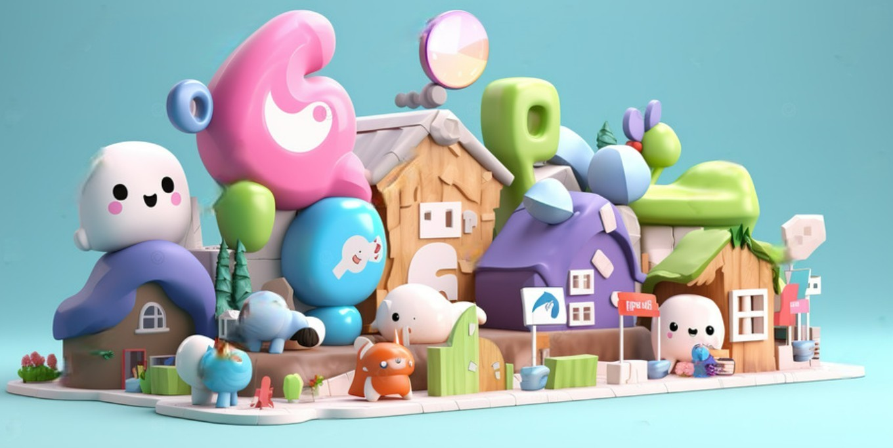

 

##  

  

# Welcome to My GitHub! 👋

---
## 🌟Introduction

**방문해주셔서 감사합니다. WASSUP2기 AI기획 부트캠프에 참여하는 김지광입니다.** 
 
이곳은 제가 진행한 프로젝트, 실험 아이디어, 그리고 교훈을 공유하는 공간입니다. 부트캠프를 통해 기술과 트렌드에 대해 깊이 탐구하고 싶습니다, 이 과정에서 형님들과 지식을 공유하고 함께 성장하는 것을 기대합니다! 
  
## 🧩Projects

이곳은 프로젝트 영역임니다. 앞으로 진행한 내용을 올릴 예정이에욤 
* [마크다운(Markdawn)](https://github.com/JIPaang/wassup2/tree/main/python_grammar) 24.02.27  
|      |      | 
|:----:|:---:|
| [마크다운(Markdawn)](https://github.com/JIPaang/wassup2/tree/main/python_grammar) | 24.02.27 | 
엔비디아 80층입니다. 요즘 너무 햄복해요 

## **🐾Contact**

  

